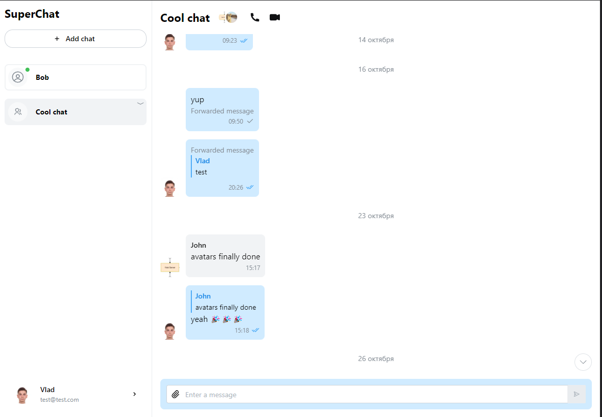
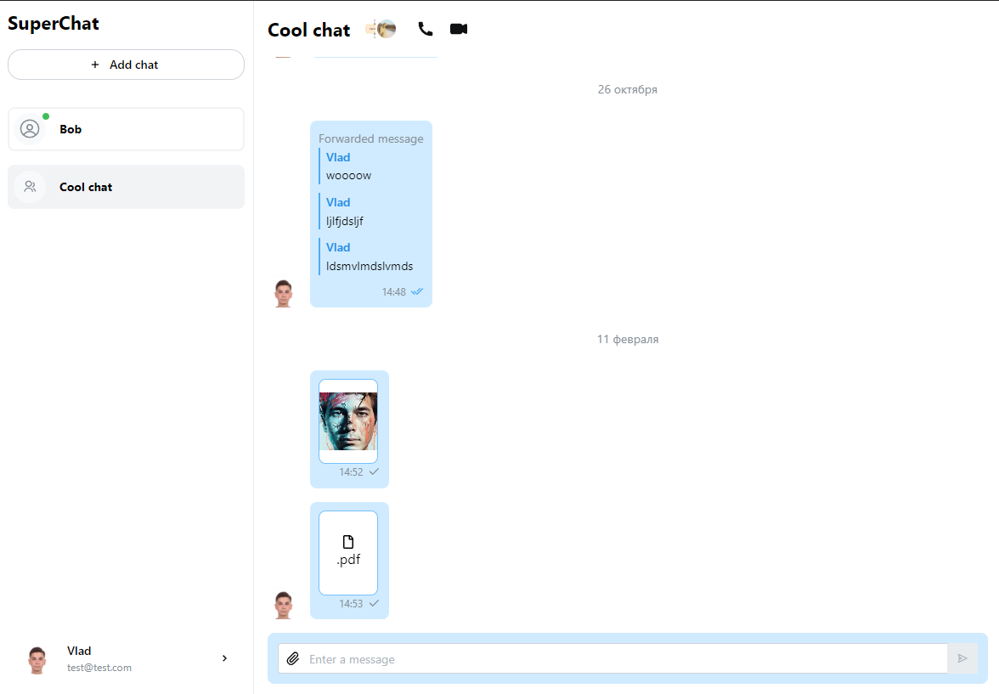
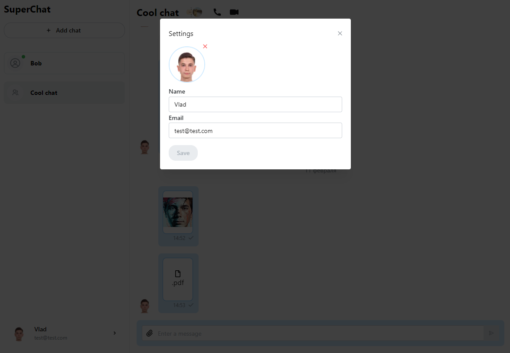

# Chat frontend

Мессенджер с основными функциями для общения [chat backend](https://github.com/vladgafarov/chat-backend)

**Стек** - React/Remix, TypeScript, socket.io, xstate, mantineUI

**Особенности**

-  Регистрация/авторизация
-  Поиск пользователей и создание чатов с ними
-  Возможность прикреплять файлы
-  Групповые чаты
-  Смена аватара

